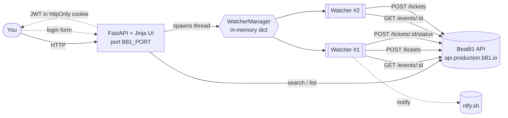
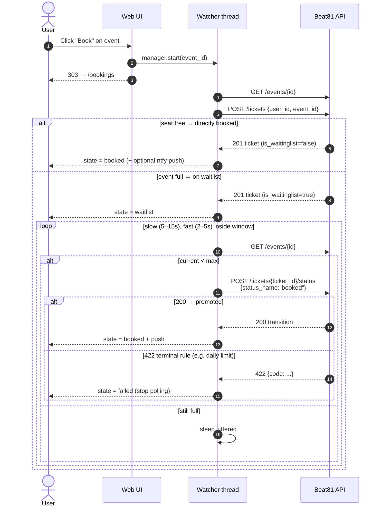
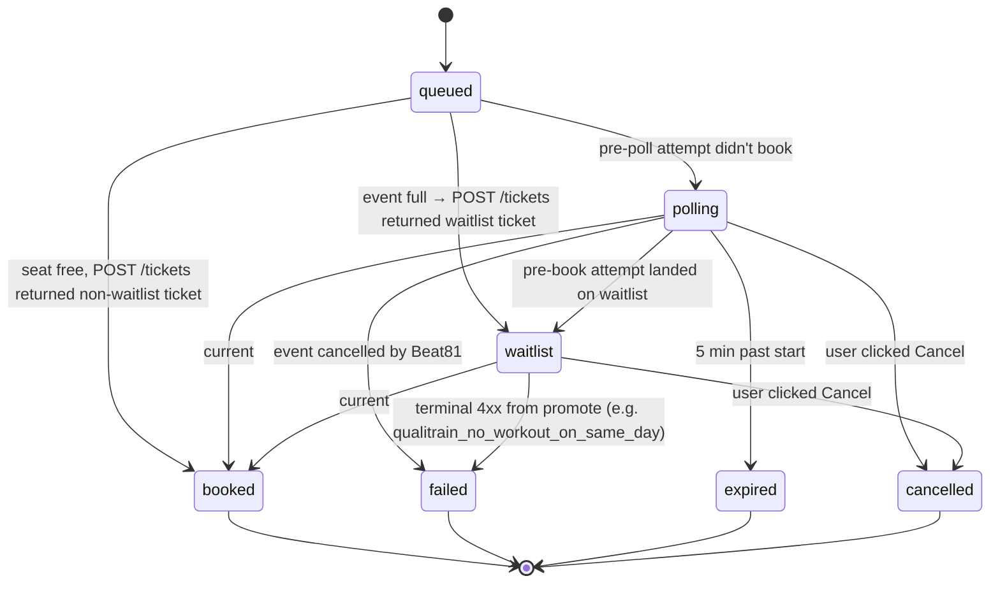

# Beat81 seat grabber

A tiny self-hosted web app that watches Beat81 workouts and books a seat the
moment one opens up.

> ⚠️ **Read the [Disclaimer](#disclaimer) before using or forking.** This is an
> unofficial project that talks to a private API; it may stop working, get you
> rate-limited, or get your account suspended. Use at your own risk.

## What it does

- **Events** page — browse upcoming workouts (filter by city, days ahead).
  Each row has a **Book** button (or **Watch & book** when full).
- **Bookings** page — your current Beat81 bookings + a live status board for
  every active watcher (auto-refreshes every 3 s via HTMX).
- Background watchers per workout: poll the public event endpoint
  immediately on a slow cadence (5–15 s) and switch to fast cadence (2–5 s)
  inside the last `B81_TIME_BEFORE_EVENT` seconds before class. The moment
  `current_participants_count < max_participants` it promotes your waitlist
  ticket to a confirmed booking via `POST /tickets/{id}/status` (the same
  call the official Beat81 app fires when you tap "Confirm"). Stops 5 min
  after class start, or as soon as Beat81 returns a terminal rejection
  (e.g. daily-limit exceeded).

## How it fits together



## Booking sequence



## Watcher state machine



## How Beat81's API works (relevant bits)

Base: `https://api.production.b81.io/api` (FeathersJS).

| Method | Path | Auth | Purpose |
| --- | --- | --- | --- |
| `POST` | `/authentication` | none | `{email, password, strategy:"local"}` → JWT |
| `GET`  | `/events?…`        | none | search |
| `GET`  | `/events/{id}`     | none | live participant count |
| `GET`  | `/tickets?user_id=…` | bearer | your bookings (incl. waitlist) |
| `POST` | `/tickets` | bearer | book / join waitlist (`{user_id, event_id}`) — idempotent: if you already hold a ticket for that event the same one is returned |
| `GET`  | `/tickets/{id}` | bearer | live status of one of your tickets |
| `POST` | `/tickets/{id}/status` | bearer | **promote a waitlist ticket** — body `{"status_name": "booked"}` returns 200 + status transition. The exact call the Beat81 app fires when you tap "Confirm". |

What does **not** work for end-users (returns 403/404):
`PATCH /tickets/{id}`, `DELETE /tickets/{id}`, `GET /offers`,
`PATCH /v2/tickets/{id}`, `DELETE /v2/tickets/{id}`, and every
`/tickets/{id}/{confirm,accept,promote,redeem,checkin}` variant.

No WebSocket / push — polling is the only option. Per Beat81's [help docs](https://support.beat81.com/en/articles/82678-how-does-the-waiting-list-work)
the waitlist is *first-come-first-served*: when a seat opens, **every**
waitlist user gets pinged simultaneously and whoever fires the promote call
first wins.

## Run it (Docker)

```bash
cp .env.example .env       # optional — only non-credential config lives here
docker compose up -d
open http://localhost:8000
```

You'll land on `/login`. Enter your Beat81 email + password; the JWT is stored
in an httpOnly cookie scoped to this site. The JWT itself lives ~24 h.

If you tick **Stay logged in**, your credentials are encrypted with
`B81_COOKIE_KEY` (Fernet) and stored in a second httpOnly cookie that's good
for 30 days. When the JWT cookie expires, the backend silently re-auths
against Beat81 and keeps your watchers running. Untick the box to opt out —
then you'll get bounced to `/login` once a day.

## Run it (without Docker)

```bash
python3 -m venv .venv
.venv/bin/pip install -r requirements.txt
.venv/bin/uvicorn beat81.server:app --host 0.0.0.0 --port "${B81_PORT:-8000}"
```

## Configuration

| Env var | Default | Meaning |
| --- | --- | --- |
| `B81_PORT` | `8000` | port the web UI listens on (host + container) |
| `B81_TIME_BEFORE_EVENT` | `1800` | seconds before class when polling switches from slow to fast cadence |
| `B81_POLL_MIN_SECS` | `2` | fast-cadence min interval (jittered) — used inside the window |
| `B81_POLL_MAX_SECS` | `5` | fast-cadence max interval |
| `B81_POLL_SLOW_MIN_SECS` | `5` | slow-cadence min interval — used from watcher start until the window |
| `B81_POLL_SLOW_MAX_SECS` | `15` | slow-cadence max interval |
| `B81_DEFAULT_CITY` | — | pre-fill the events filter (e.g. `BER`, `MUC`) |
| `B81_NTFY_TOPIC` | — | optional [ntfy.sh](https://ntfy.sh) topic for phone push |
| `B81_COOKIE_SECURE` | `0` | set to `1` when serving over HTTPS so the auth cookies get the `Secure` flag |
| `B81_COOKIE_KEY` | — | Fernet key for the "Stay logged in" cookie. Generate with `python -c 'from cryptography.fernet import Fernet; print(Fernet.generate_key().decode())'`. If unset, an ephemeral key is generated at boot and printed once (remember-me won't survive restarts) |
| `B81_VERBOSE` | `1` | log every Beat81 API request and response to stdout (set to `0` to silence) |
| `B81_LOG_RESP_TRUNC` | `600` | bytes of each API response to keep in the log line (full responses get a one-line `summary>` underneath) |

## Notes & caveats

- **Rate limits unknown.** Slow cadence is one `GET /events/{id}` + one
  `GET /tickets/{id}` every 5–15 s, fast cadence every 2–5 s inside the
  window. Lengthen `B81_POLL_MIN_SECS` / `B81_POLL_SLOW_MIN_SECS` if you
  see throttling.
- This is a private API — Beat81 can change or block it at any time.
- **Membership-rule rejections are terminal.** If `POST /tickets/{id}/status`
  returns a 422 with one of the known codes (`qualitrain_no_workout_on_same_day`,
  `no_credits`, `event_already_started`, …) the watcher surfaces the message
  and stops polling — retrying won't help. Edit `_TERMINAL_PROMOTE_CODES` in
  `beat81/watcher.py` if Beat81 introduces a new code you want to handle.
- The login form is the only auth on the web UI: anyone who can reach the
  port and has valid Beat81 credentials can log in. Don't expose the
  configured port to the internet without putting it behind something like
  Tailscale, a Cloudflare tunnel, or a reverse proxy with basic auth. When
  serving over HTTPS, set `B81_COOKIE_SECURE=1`.
- **Watcher session refresh.** With "Stay logged in" checked, watcher
  threads transparently re-auth (using the encrypted credentials cookie
  captured when the watcher was armed) and keep polling indefinitely.
  Without it, in-flight watchers fail at JWT expiry (~24 h) and you'll need
  to re-login and re-arm them.
- The mobile app's "Confirm" path was discovered by reading a real network
  request from `app.beat81.com`. If Beat81 changes the endpoint or payload
  shape this script will break — you'd repeat the discovery: open the web
  app's DevTools Network tab, tap Confirm on a real waitlist offer, and
  copy the new `Method`, `URL`, and `Body` into `beat81/api.py`.

## Disclaimer

**This project is not affiliated with, endorsed by, sponsored by, or
otherwise officially connected to BEAT81 GmbH or any of its subsidiaries or
affiliates.** "BEAT81" and any related marks are property of their respective
owners and are referenced here strictly for descriptive interoperability.

This software is published for **educational and personal-use purposes only**.
It interacts with a private, undocumented HTTP API that BEAT81 has not
published or licensed for third-party use.

By downloading, running, hosting, forking, modifying, or otherwise using this
software you acknowledge and agree that:

1. **No warranty.** The software is provided **"AS IS", WITHOUT WARRANTY OF
   ANY KIND**, express or implied, including but not limited to the warranties
   of merchantability, fitness for a particular purpose, title, and
   non-infringement. The authors and contributors disclaim all liability for
   any direct, indirect, incidental, special, exemplary, or consequential
   damages arising from its use, including but not limited to lost bookings,
   missed workouts, account suspension or termination, payment of cancellation
   fees, breach-of-contract claims, or any other loss.
2. **Terms of Service risk.** Automated interaction with BEAT81's systems may
   violate BEAT81's [Terms and Conditions](https://www.beat81.com/terms-and-conditions-en)
   or other applicable agreements. **You are solely responsible** for reading
   and complying with the current terms applicable to your account, region,
   and membership tier. The authors make no claim that this software is
   compliant with those terms and provide no legal advice.
3. **Account safety.** Use of this tool may result in rate-limiting,
   temporary or permanent suspension, termination of your BEAT81 account,
   forfeiture of class credits, or other actions BEAT81 chooses to take. **You
   accept those risks entirely.**
4. **No abuse.** Do not configure aggressive polling intervals, do not run
   many parallel watchers against the same studio, do not redistribute or
   resell the software as a service, and do not use it in any way intended to
   degrade BEAT81's infrastructure or harm other members. Behaviour of that
   kind is **not** a permitted use of this software.
5. **Your credentials, your responsibility.** This software requires your
   BEAT81 email and password — entered through the web UI's login form,
   forwarded to BEAT81's authentication endpoint, and held as a JWT in a
   browser cookie for the session. Never commit credentials to a repository
   or expose the running web UI to the public internet without putting it
   behind a network-level guard (Tailscale, VPN, reverse-proxy auth, …).
6. **Removal on request.** If you are a rights holder at BEAT81 and would like
   this project taken down or modified, please open an issue on this
   repository — the maintainers will respond in good faith.

If you do not agree to all of the above, **do not use this software.**

## License

[MIT](LICENSE) — see file for full text.
