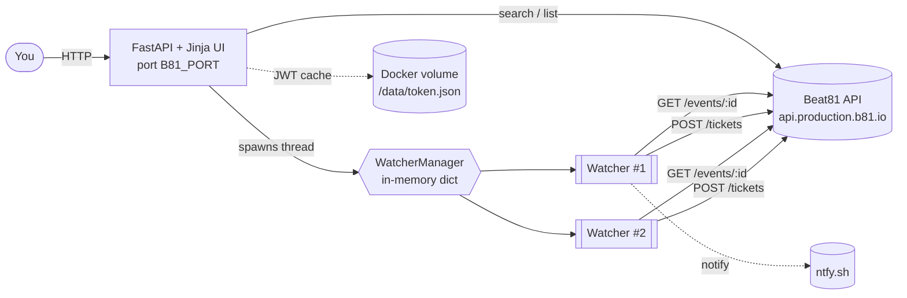
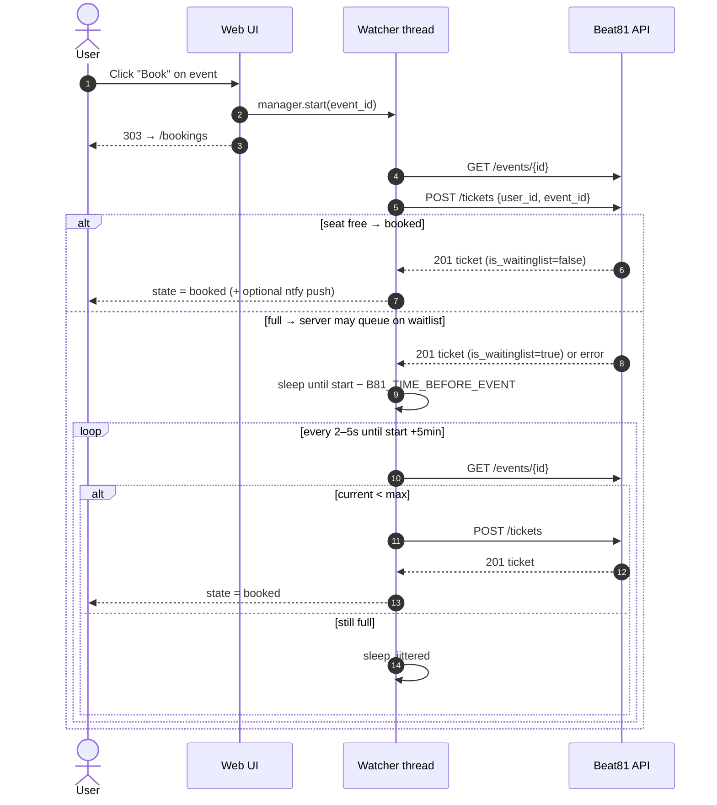
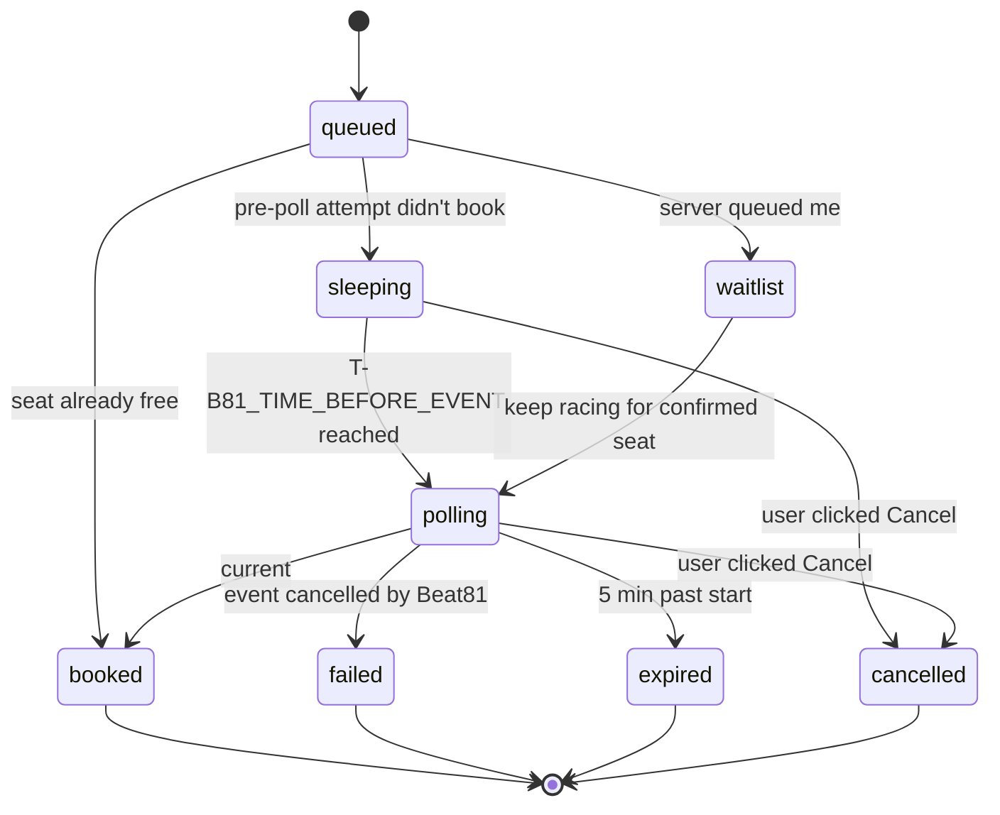

# Beat81 grabber

A tiny self-hosted web app that watches Beat81 workouts and books a seat the
moment one opens up.

> ⚠️ **Read the [Disclaimer](#disclaimer) before using or forking.** This is an
> unofficial project that talks to a private API; it may stop working, get you
> rate-limited, or get your account suspended. Use at your own risk.

## What it does

- **Events** page — browse upcoming workouts (filter by city, days ahead).
  Each row has a **Book** button (or **Watch & book** when full).
- **Bookings** page — your current Beat81 bookings + a live status board for
  every active watcher (auto-refreshes every 3 s via HTMX).
- Background watchers per workout: sleep until `B81_TIME_BEFORE_EVENT`
  seconds before class start, then poll the public event endpoint every
  2–5 s and `POST /tickets` the moment `current_participants_count <
  max_participants`. Stops 5 min after class start.

## How it fits together



## Booking sequence



## Watcher state machine



## How Beat81's API works (relevant bits)

Base: `https://api.production.b81.io/api` (FeathersJS).

| Method | Path | Auth | Purpose |
| --- | --- | --- | --- |
| `POST` | `/authentication` | none | `{email, password, strategy:"local"}` → JWT |
| `GET`  | `/events?…`        | none | search |
| `GET`  | `/events/{id}`     | none | live participant count |
| `GET`  | `/tickets?user_id=…` | bearer | your bookings (incl. waitlist) |
| `POST` | `/tickets` | bearer | book / join waitlist (`{user_id, event_id}`) |

No WebSocket / push — polling is the only option.

## Run it (Docker)

```bash
cp .env.example .env       # then edit credentials
docker compose up -d
open http://localhost:8000
```

That's it. The JWT is cached in a named volume so you don't re-login on
restart.

## Run it (without Docker)

```bash
python3 -m venv .venv
.venv/bin/pip install -r requirements.txt
export B81_EMAIL=... B81_PASSWORD=...
.venv/bin/uvicorn beat81.server:app --host 0.0.0.0 --port "${B81_PORT:-8000}"
```

## Configuration

| Env var | Default | Meaning |
| --- | --- | --- |
| `B81_EMAIL` | — | Beat81 login (required) |
| `B81_PASSWORD` | — | Beat81 password (required) |
| `B81_PORT` | `8000` | port the web UI listens on (host + container) |
| `B81_TIME_BEFORE_EVENT` | `1800` | seconds before class to start fast polling |
| `B81_POLL_MIN_SECS` | `2` | min interval between polls (jittered) |
| `B81_POLL_MAX_SECS` | `5` | max interval between polls |
| `B81_DEFAULT_CITY` | — | pre-fill the events filter (e.g. `BER`, `MUC`) |
| `B81_NTFY_TOPIC` | — | optional [ntfy.sh](https://ntfy.sh) topic for phone push |
| `B81_TOKEN_CACHE` | `~/.cache/beat81/token.json` (`/data/token.json` in Docker) | JWT cache path |

## Notes & caveats

- **Rate limits unknown.** 2-second polling for ~30 minutes = ~900 requests
  per watcher per session. Lengthen `B81_POLL_MIN_SECS` if you get throttled.
- This is a private API — Beat81 can change or block it at any time.
- `POST /tickets` payload `{user_id, event_id}` confirmed working.
- Single-user only: there is no auth on the web UI itself. Don't expose the
  configured port to the internet without putting it behind something like
  Tailscale, a Cloudflare tunnel, or basic auth.

## Disclaimer

**This project is not affiliated with, endorsed by, sponsored by, or
otherwise officially connected to BEAT81 GmbH or any of its subsidiaries or
affiliates.** "BEAT81" and any related marks are property of their respective
owners and are referenced here strictly for descriptive interoperability.

This software is published for **educational and personal-use purposes only**.
It interacts with a private, undocumented HTTP API that BEAT81 has not
published or licensed for third-party use.

By downloading, running, hosting, forking, modifying, or otherwise using this
software you acknowledge and agree that:

1. **No warranty.** The software is provided **"AS IS", WITHOUT WARRANTY OF
   ANY KIND**, express or implied, including but not limited to the warranties
   of merchantability, fitness for a particular purpose, title, and
   non-infringement. The authors and contributors disclaim all liability for
   any direct, indirect, incidental, special, exemplary, or consequential
   damages arising from its use, including but not limited to lost bookings,
   missed workouts, account suspension or termination, payment of cancellation
   fees, breach-of-contract claims, or any other loss.
2. **Terms of Service risk.** Automated interaction with BEAT81's systems may
   violate BEAT81's [Terms and Conditions](https://www.beat81.com/terms-and-conditions-en)
   or other applicable agreements. **You are solely responsible** for reading
   and complying with the current terms applicable to your account, region,
   and membership tier. The authors make no claim that this software is
   compliant with those terms and provide no legal advice.
3. **Account safety.** Use of this tool may result in rate-limiting,
   temporary or permanent suspension, termination of your BEAT81 account,
   forfeiture of class credits, or other actions BEAT81 chooses to take. **You
   accept those risks entirely.**
4. **No abuse.** Do not configure aggressive polling intervals, do not run
   many parallel watchers against the same studio, do not redistribute or
   resell the software as a service, and do not use it in any way intended to
   degrade BEAT81's infrastructure or harm other members. Behaviour of that
   kind is **not** a permitted use of this software.
5. **Your credentials, your responsibility.** This software requires your
   BEAT81 email and password. Store them securely (e.g. environment variables,
   secret managers). Never commit them to a repository, ship them in a public
   image, or expose the running web UI to the public internet without
   authentication.
6. **Removal on request.** If you are a rights holder at BEAT81 and would like
   this project taken down or modified, please open an issue on this
   repository — the maintainers will respond in good faith.

If you do not agree to all of the above, **do not use this software.**

## License

[MIT](LICENSE) — see file for full text.
